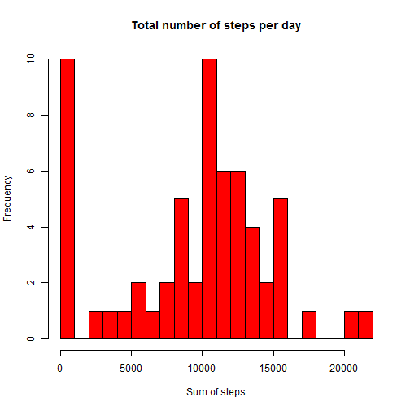
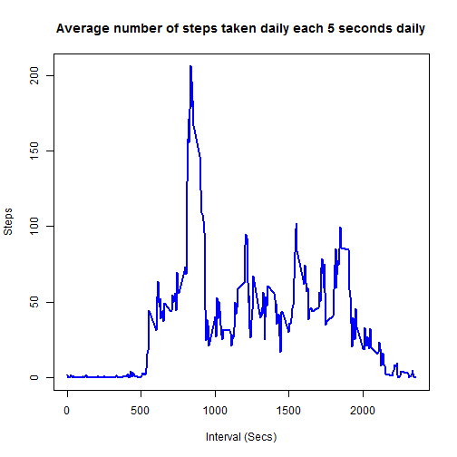

Firstly, I am going to load the data will be used in the rest of analysis. This data monitoring personal activity using a personal activity monitoring device.


```r
file_name <- "activity.csv"
activity_data <- read.csv(file_name)
```

We will make some exploration of the data.


```r
# showing the data size
dim(activity_data)
```

```
## [1] 17568     3
```

```r
# showing the names of the 3 variables in data
names(activity_data)
```

```
## [1] "steps"    "date"     "interval"
```

The following code will answer some questions concerning the activity data...

##What is mean total number of steps taken per day?

1. I will create a variable called steps_per_day showing the sum of numbers taken each day.


```r
steps_per_day <- by(activity_data$steps, activity_data$date, function(x) sum(x, na.rm = TRUE))
```

2. The following is a histogram showing the frequency of each number of total number of steps taken per day.


```r
hist(steps_per_day, breaks = 20, xlab = "Sum of steps", col = "red", main = "Total number of steps per day")
```

 

3. To answer the main question, the following code will report the mean and median of of the total number of steps taken per day.

Mean of the total number of steps taken per day is:


```r
mean(steps_per_day)
```

```
## [1] 9354.23
```

Median of the total number of steps taken per day is:


```r
median(steps_per_day)
```

```
## 2012-10-20 
##      10395
```

##What is the average daily activity pattern?

For this question, it is easier ot use dplyr package.


```r
library(dplyr)
```

The following plot showing the 5-minute interval and the average number of steps taken, averaged across all days.


```r
interval_steps <- aggregate(steps ~ interval, data = activity_data, FUN=function(activity_data) mean = mean(activity_data, na.rm = TRUE))
plot(interval_steps$interval, interval_steps$steps, type = "l", xlab = "Interval (Secs)", ylab = "Steps", main = "Average number of steps taken daily each 5 seconds daily", col = "blue", lwd = 2)
```

 

```r
# get the interval that have the maximum number of steps
index <- which(interval_steps$steps == max(interval_steps$steps))
interval_steps$interval[index]
```

```
## [1] 835
```

The previous plot and code showed that maximum number of steps (averaged across all days) was taken at 835 secs interval.

##Imputing missing values

The following code aims to calculate the total number of incomplete rows i.e. observations with NA values.


```r
sum(is.na(activity_data$steps))
```

```
## [1] 2304
```

The total number of incomplete observations in our data set is 2304 observations, which represent about 13.11% of all observations in the dataset.

Therefore, we are going to compromise a way to replace missing values. I will create a new data set with all of the NA values replaced with the intger 0.


```r
data_without_missing <- activity_data
data_without_missing[is.na(data_without_missing)] <- 0
```

To examine the effect of replacing NAs with 0s, we will draw the same histogram showing the total number of steps taken each day. Moreover, we will calculate the mean and median for each total number of steps taken each day.


```r
full_steps_per_day <- by(data_without_missing$steps, data_without_missing$date, function(x) sum(x, na.rm = TRUE))
hist(full_steps_per_day, breaks = 20, xlab = "Sum of steps", col = "red", main = "Total number of steps per day")
```

 

Mean of the total number of steps taken per day after replacing NAs is:


```r
mean(full_steps_per_day)
```

```
## [1] 9354.23
```

Median of the total number of steps taken per day after replacing NAs is:


```r
median(full_steps_per_day)
```

```
## 2012-10-20 
##      10395
```

The previous histogram and calculations showing that there are no differences between the mean and median of steps taken each day before and after imputting the NA values.
